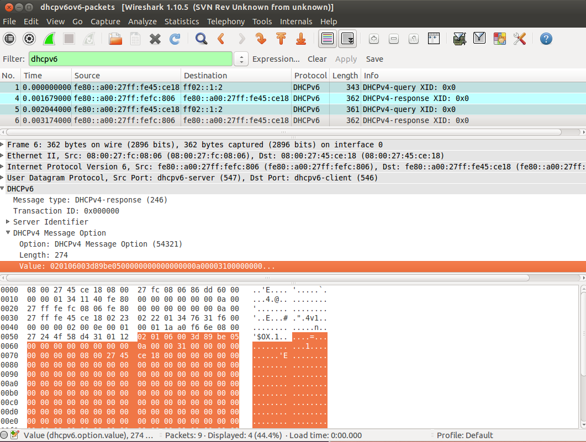

Introduction
=============

DHCPv4 over DHCPv6 is an extension to DHCPv4. It puts DHCPv4 message into DHCPv6 options and transported in DHCPv6 messages, so users in IPv6 network can use it to get IPv4 addresses and configurations. The document is at http://datatracker.ietf.org/doc/draft-ietf-dhc-dhcpv4-over-dhcpv6/.

This respository is an impletation of DHCPv4 over DHCPv6 server (4o6 server) by Tsinghua University 4over6 research group. Current code is based on isc [bind10-1.1.0](http://bind10.isc.org/wiki). 


Install
=============
Follw the build and installation process of bind10:

```
./configure --prefix=$HOME/local/bind10
make
make install
```

Before compiling, you may need to install some additional tools such as python3. See https://bind10.isc.org/wiki/InstallStartPage for more instuctions.


Starting
=============
Follow the guide at http://bind10.isc.org/docs/bind10-guide.html .

To start the DHCPv4 over DHCPv6 function, simply start DHCPv4 Server and DHCPv6 Server module. DHCPv4 server needs to be configured with an address pool. The DHCPv4 address pools is available for both native DHCPv4 and DHCPv4-over-DHCPv6 queries.There's no additional configuration for DHCPv4-over-DHCPv6 function.


Captured Packet Data 
=============
A pakcet data of the 4-step DHCP handshake captured by wireshark can be found at [bdhcpv4ov6-wireshark.pcap](dhcpv4ov6-wireshark.pcap).


